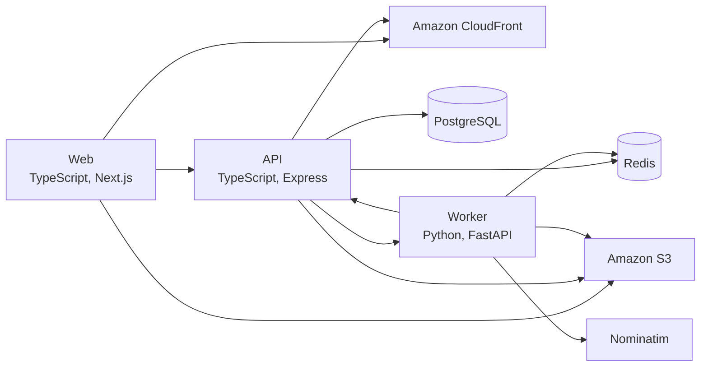

# Photos

Photos is a personal photo and video library with uploads, albums, share links, search and grouping by face. A Next.js web app talks to an Express API that keeps files in Amazon S3 and metadata in PostgreSQL, while a Python worker takes jobs from a Redis queue to build thumbnails, CLIP embeddings and face clusters.

